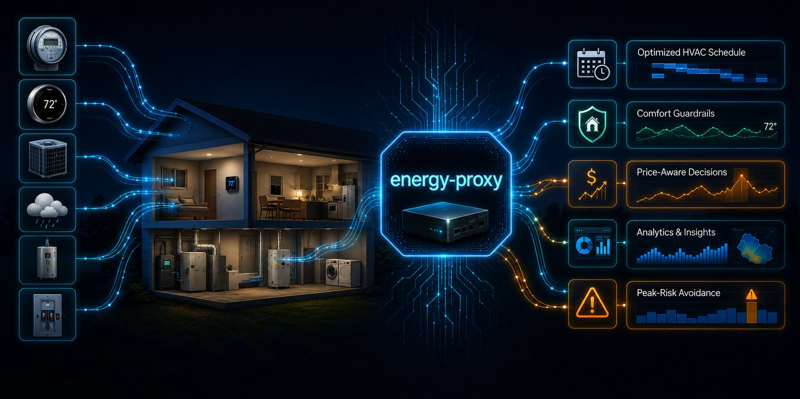

  

  
  
  
  
  

# energy-proxy

Home energy monitoring and ComEd-RTP-aware HVAC cost optimization running as a
Docker Compose stack on Pi-lab. Single ComEd Hourly Pricing household; IECC climate
zone 5A; Amana CTK04AE thermostat on a 2-stage AC + modulating furnace.

## The controller

Two control approaches — retained for a 2027 cost-savings comparison once Arm B is
fully commissioned and validated:

- **Arm A** — the CTK04AE's internal programmed schedule runs autonomously.
  `hvac-scheduler` stays in `shadow` mode (telemetry only, no writes).
- **Arm B** — the Arm A comfort baseline **plus price awareness**. Holds the
  baseline and drifts *warmer* when ComEd RTP prices are elevated. Warm-only;
  never cools below the current baseline. Safety is device-owned: the thermostat's
  setpoint min/max limits are the hard cap; timed holds (never Permanent) revert to
  the onboard schedule if the controller dies.

**2026 goal:** get Arm B built, running in shadow, then live for the season, then
review at season end. The Arm A vs Arm B cost-savings comparison is the **2027
experiment** — deferred, not active in 2026.

Controller design: [`docs/superpowers/specs/2026-06-20-commissioning-controller-design.md`](docs/superpowers/specs/2026-06-20-commissioning-controller-design.md)
Commissioning plan: [`docs/superpowers/plans/2026-06-20-commissioning-controller-plan.md`](docs/superpowers/plans/2026-06-20-commissioning-controller-plan.md)

> **Historical / superseded:** `docs/HVAC_LOGIC.md`, `docs/CONTROLLER_CONSTANTS.md`,
> `docs/OSF_FILING_MECHANICS.md`, and `docs/plans/sced-rebaseline-spec-2026-05-13.md`
> describe the old OSF-preregistered SCED experiment design (offline, retracted).
> Retained as historical record only.
>
> **Onboard fallback schedule (⚠ stale — refresh before go-active):**
> `docs/THERMOSTAT_ARM_A_SCHEDULE.md` is the designated home for the CTK04AE onboard
> fallback schedule — the device-native safety fallback a lapsed timed-hold reverts
> to. Its CONTENT is stale (old OSF-era schedule + Permanent-hold/day-type language)
> and must be refreshed to the deployed program before go-active; not yet
> authoritative.

## What's in this repo

- **Controller** — `hvac-scheduler` service. Current spec/plan linked above.
- **Arm apparatus** — CTK04AE program (Arm A) and price-overlay controller (Arm B),
  retained for the 2027 comparison.
- **Telemetry pipeline** — Docker Compose stack of pollers + InfluxDB + Grafana +
  Loki, under [`deploy/energy-stack/`](deploy/energy-stack/). Per-service detail in
  [`docs/SERVICES.md`](docs/SERVICES.md).
- **Analysis pipeline** — Flux query library and replay harness under
  [`tools/analysis/`](tools/analysis/); historical bundles under
  [`tools/comed_2025_analysis/`](tools/comed_2025_analysis/) and
  [`tools/o2_capacity_reconstruction/`](tools/o2_capacity_reconstruction/).
- **5CP telemetry** — PJM capacity-peak data collected and retained for later
  analysis; not a live control input.

## Architecture

![Architecture: ComEd Hourly Pricing and CTK04AE thermostat state are the ONLY live controller inputs to hvac-scheduler (Arm B). All other feeds — EAGLE-3, PJM Data Miner 2, NWS, Refoss EM16P, Ecowitt, ComfortNet CT-485 bus via MQTT — flow into InfluxDB 2.7 as telemetry/observability only, NOT controller inputs. InfluxDB feeds Grafana dashboards, Loki + Promtail logs, and the telegram-notifier. The scheduler pushes setpoints to the CTK04AE thermostat driving a 2-stage Amana AC and modulating furnace. Note: architecture PNG predates this controller redesign and needs regeneration to reflect the input split.](docs/diagrams/architecture.png)

> ⚠ **The diagram above is stale** — it predates the controller redesign. Current reality: the controller's only live inputs are **ComEd RTP price + CTK04AE thermostat state**; PJM 5CP, NWS, Refoss, Ecowitt, and EAGLE-3 are **telemetry only**, not controller inputs. Regeneration pending.

> Diagram source: [`docs/diagrams/architecture.mmd`](docs/diagrams/architecture.mmd) (Mermaid).
> Re-render with `npx -y @mermaid-js/mermaid-cli -i docs/diagrams/architecture.mmd -o docs/diagrams/architecture.png -t neutral -b white -w 1600 -H 1400` (SVG is also committed at the same path).

Stack runs as a single Docker Compose project. Deployment is automated: merging to
`main` triggers a GitHub Actions workflow that joins the operator's tailnet as an
ephemeral CI node and updates the stack in place. No public ingress.

## Reading path

1. [`docs/PROJECT.md`](docs/PROJECT.md) — project narrative, decisions, phase history, hardware inventory.
2. [`INDEX.md`](INDEX.md) — canonical document map (every active doc, grouped by intent).
3. [`docs/superpowers/specs/2026-06-20-commissioning-controller-design.md`](docs/superpowers/specs/2026-06-20-commissioning-controller-design.md) — current controller spec.
4. [`deploy/energy-stack/README.md`](deploy/energy-stack/README.md) — stack ops, ports, secrets, restore.

For AI agents: `AGENTS.md` (local, gitignored — not in the committed repo) is the standing behavior contract for this repo.
Legacy operator README archived at [`docs/archive/README-LEGACY.md`](docs/archive/README-LEGACY.md).

## License

[MIT](LICENSE) — see also [`SECURITY.md`](SECURITY.md).
