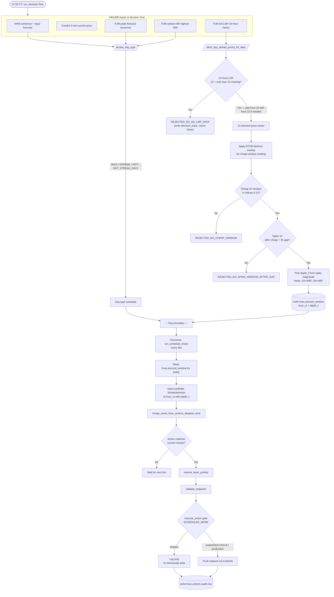
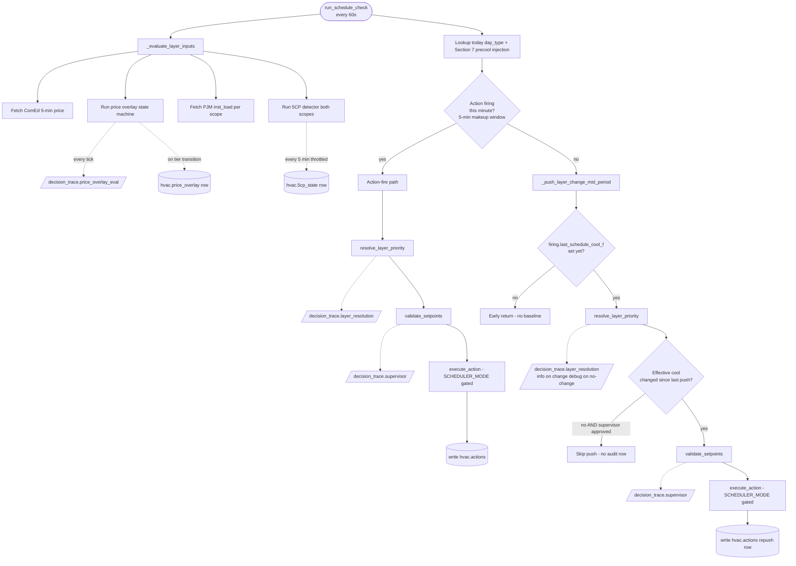
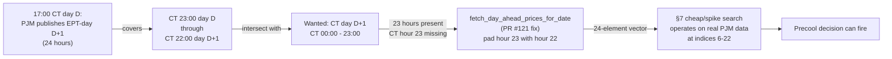

# HVAC Scheduler — Timing + Decision Diagrams

Visual reference for what fires when in the HVAC scheduler stack and how decisions flow from raw poller inputs through to thermostat actions. Companion to [`HVAC_LOGIC.md`](HVAC_LOGIC.md) (prose spec); this file is the picture-book equivalent.

Three diagrams below, rendered inline via GitHub's Mermaid support:

1. **Daily activity timeline** — when each component fires across a 24-hour CT day.
2. **Precool decision flow** — the §7 day-ahead price-aware precool path, from 21:00 CT decision through tomorrow's action firing.
3. **Per-tick decision tree** — what every 60s scheduler tick does, and where each `decision_trace.*` log line emits.

## Diagram 1 — Daily activity timeline (CT)

Continuous bars = processes that run on a recurring cadence. Milestones = discrete events at specific times. DTOD delivery rates are the ComEd-fixed time-of-day distribution charges that the §7 cheap-window search ranks against (alongside the variable PJM day-ahead supply LMPs).

```mermaid
gantt
    title HVAC Scheduler — 24-hour activity (CT local)
    dateFormat HH:mm
    axisFormat %H:%M

    section Continuous pollers
    comed-poller every 60s             :a1, 00:00, 24h
    eagle-poller every 30s             :a2, 00:00, 24h
    refoss-poller every 30s            :a3, 00:00, 24h
    pjm inst_load every 5min           :a4, 00:00, 24h
    nws-poller every 30min             :a5, 00:00, 24h
    thermostat-poller every 10min      :a6, 00:00, 24h

    section Scheduler ticks
    run_schedule_check every 60s       :s1, 00:00, 24h

    section DTOD delivery cents per kWh
    Overnight 2.98                     :done, 00:00, 6h
    Morning 4.01                       :done, 06:00, 7h
    Mid-Day Peak 10.71                 :crit, 13:00, 6h
    Evening 3.75                       :done, 19:00, 2h
    Overnight 2.98                     :done, 21:00, 3h

    section Section 7 cheap-window search range
    Search 06-15 CT                    :w1, 06:00, 9h

    section Discrete events
    MILD release_hold                  :milestone, 00:05, 0
    HOT_STREAK pre-cool                :milestone, 03:00, 0
    HOT pre-cool                       :milestone, 04:00, 0
    NORMAL PRE_COOL                    :milestone, 06:00, 0
    run_decision_revisit 06:00         :milestone, 06:00, 0
    run_decision_revisit 11:00         :milestone, 11:00, 0
    HOT COAST                          :milestone, 12:00, 0
    NORMAL COAST                       :milestone, 13:00, 0
    pjm DA LMP publish (tomorrow EPT)  :milestone, crit, 17:00, 0
    NORMAL RECOVER                     :milestone, 19:00, 0
    NORMAL SLEEP                       :milestone, 21:00, 0
    run_decision nightly               :milestone, crit, 21:00, 0
```

**Key observations from the timeline:**

- The §7 cheap-window search (06:00-15:00 CT) sits inside the Morning DTOD period (controller-side base rate 4.01¢/kWh, second-cheapest of the day) and ends as the Mid-Day Peak (10.71¢/kWh base) starts. By design — pre-cool during cheap morning, ride out the expensive mid-day with thermal mass. (Note: these are base/sensitivity DTOD rates the controller uses for cheap-window ranking; the bill-canonical resultant rates per binding spec §8 are 4.428 / 11.727 / 4.142 / 3.311 ¢/kWh for Morning / Mid-Day Peak / Evening / Overnight respectively.)
- PJM publishes tomorrow's EPT-day DA LMP at 17:00 CT. `run_decision` consumes it at 21:00 CT — a 4-hour buffer. Per PR #121 (merged) the structurally-missing CT-hour-23 at the EPT/CT day boundary is accepted; see §EPT-vs-CT precool boundary below.
- Day-type pre-cool actions fire before 06:00 CT on HOT (04:00) and HOT_STREAK_DAY1 (03:00) days. The §7 path is currently bounded ≥06:00; that asymmetry is open for discussion (separate from the boundary fix).
- All discrete actions have a 5-minute makeup window, so an action at e.g. 13:00 fires on the first tick at or after 13:00 (up to 13:05) where the prior tick hasn't already marked it fired.

## Diagram 2 — Precool decision flow

**Where bugs surface in this picture:**

- The `FetchBoundary` diamond is the EPT-vs-CT structural boundary. Pre-PR-#121, this defaulted to "No" for the 23-hour-only-hour-23-missing case → every nightly §7 precool decision rejected silently → no `hvac.precool_window` rows ever written → no §7 precool action injected tomorrow. PR #121 (merged) accepts the 23 + hour-23-padded case, allowing the path to actually fire.
- The `Cheap` diamond's search range (indices 6-14) is the source of the "precool can't start before 06:00 CT" constraint Chris flagged. Separate from the boundary fix; not changed in PR #121.

## Diagram 3 — Per-tick scheduler decisions

**Trace emission cadence by event type:**

| Event | Cadence | Volume per day (verbose=true) |
|---|---|---|
| `decision_trace.price_overlay_eval` | every tick (1/min) | ~1440 |
| `decision_trace.layer_resolution` | per `_push_layer_change_mid_period` (1/tick if baseline set) + per action fire (4-7/day) | ~1000-1500 |
| `decision_trace.supervisor` | per `validate_setpoints` call (~same as layer_resolution) | ~1000-1500 |
| `decision_trace.day_type_decision` | per `decide_day_type` call (21:00 + revisits) | 3 |
| `decision_trace.precool_decision` | once at 21:00 CT | 1 |

In commissioning verbose mode, ~3000-4500 trace lines/day flow through Loki. In experiment mode (verbose=false), only the info-level emissions (transitions / state changes / fires / rejections) — far fewer.

## EPT-vs-CT precool boundary (post-fix)

PJM publishes day-ahead LMP indexed by **EPT calendar day**. The scheduler operates on **CT calendar day**. EPT runs **1 hour ahead of CT year-round** (both zones observe DST simultaneously — this offset is constant, not DST-specific).

At a 21:00 CT day-D decision for tomorrow's precool window:

The padded hour (CT 23:00 day D+1) is outside the cheap-window search (06:00-15:00) and at the tail of the spike search range — padding with hour 22's value introduces no false positives and the operationally-required hours (6-22) are all real PJM data.

PR #121 contains the fix + live verification.

## Source files referenced

| File | Role |
|---|---|
| [`deploy/energy-stack/hvac-scheduler/app.py`](../deploy/energy-stack/hvac-scheduler/app.py) | Main scheduler: `run_schedule_check`, `run_decision`, `_evaluate_layer_inputs`, `_push_layer_change_mid_period`, `fetch_day_ahead_prices_for_date`, all `_trace_*` helpers |
| [`deploy/energy-stack/hvac-scheduler/precool.py`](../deploy/energy-stack/hvac-scheduler/precool.py) | §7 cheap-window + spike-window pure rule functions, DTOD rate schedule |
| [`deploy/energy-stack/hvac-scheduler/safety_supervisor.py`](../deploy/energy-stack/hvac-scheduler/safety_supervisor.py) | `validate_setpoints` clamp + emergency-override logic |
| [`deploy/energy-stack/hvac-scheduler/price_overlay.py`](../deploy/energy-stack/hvac-scheduler/price_overlay.py) | Tier state machine (normal / elevated / scarcity) with hysteresis + minimum hold |
| [`deploy/energy-stack/hvac-scheduler/pjm_5cp.py`](../deploy/energy-stack/hvac-scheduler/pjm_5cp.py) | Dual-scope 5CP detector (ComEd zone + PJM RTO) |
| [`deploy/energy-stack/hvac-scheduler/decision_codes.py`](../deploy/energy-stack/hvac-scheduler/decision_codes.py) | Append-only enums for all `reason_code` values |
| [`deploy/energy-stack/pjm-dm2-poller/app.py`](../deploy/energy-stack/pjm-dm2-poller/app.py) | `fetch_da_lmp_for_tomorrow` + per-feed schedule |
| [`docs/HVAC_LOGIC.md`](HVAC_LOGIC.md) | Prose specification of day-type schedules, supervisor rules, ISU settings, fallback behavior |
| [`docs/plans/archive/decision-trace-plan.md`](plans/archive/decision-trace-plan.md) | Phased plan that delivered the `decision_trace.*` event family (Phases 1-5, all merged; archived) |

## Doc maintenance

When schedules / thresholds / call sites change in the source files, update the diagrams here. Keep this doc and `HVAC_LOGIC.md` in sync — the prose is authoritative for behavior, this is the visual cross-reference.

Diagrams render natively in GitHub's web UI. To preview locally, paste any `mermaid` code block into [mermaid.live](https://mermaid.live).
